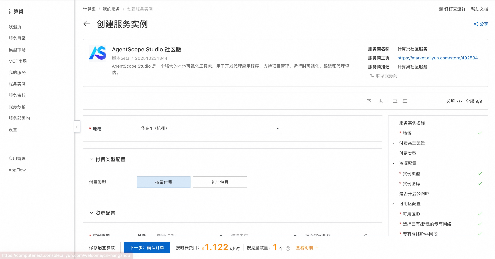
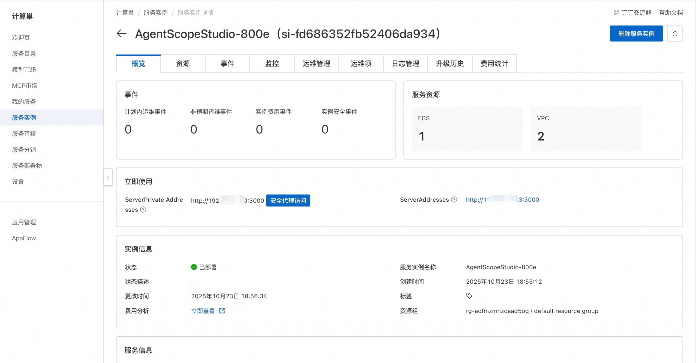
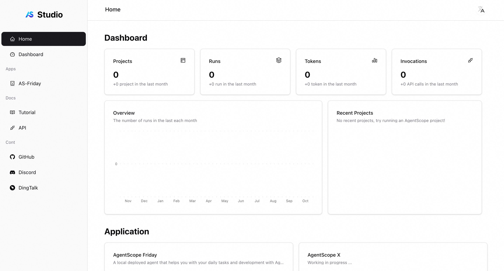

## 🌟 服务简介

AgentScope Studio 是一个强大的本地可视化工具包，用于开发代理应用程序，支持项目管理、运行时可视化、跟踪和代理评估。

## 🚀 部署流程

1. 访问计算巢AgentScope Studio 社区版[部署链接](https://computenest.console.aliyun.com/service/instance/create/cn-hangzhou?type=user&ServiceId=service-d4aed774828d45bf9792)，按提示填写部署参数：
   

2. 参数填写完成后可以看到对应询价明细，确认参数后点击**下一步：确认订单**。

3. 确认订单完成后同意服务协议并点击**立即创建**进入部署阶段。

4. 等待部署完成后进入服务实例详情页。
   

5. 访问服务器，进入AgentScope Studio控制台。
    

# 📚 使用指南

更多用法请参考AgentScope Studio [官网文档](https://doc.agentscope.io/zh_CN/)。